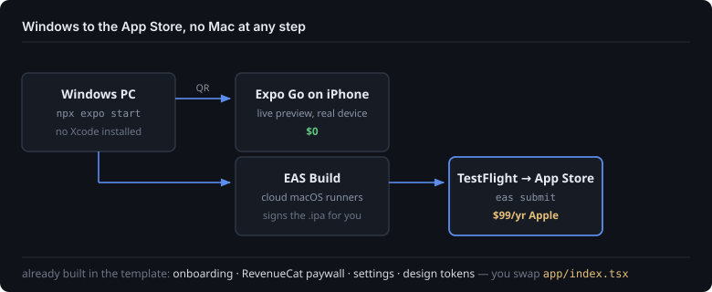

# app-studio

**Ship an iOS app without owning a Mac.**

Everything here runs on Windows. Development, preview on a real iPhone, the
production build, and App Store submission — no Xcode, no borrowed MacBook, no
cloud Mac rental.



A reusable Expo/React Native template plus the process around it: take a one-page
spec, reskin the template, wire one AI feature, submit. Onboarding flow,
RevenueCat paywall, settings, and themeable design tokens are already built — the
only file you swap per app is `app/index.tsx`.

**Status: a working template and toolchain, not a shipped app.** Three days of
build in July 2026, and nothing went to the App Store. Read it as a validated
stack and a starting point, not a product.

## Layout

```
template-base/   the starter you clone per app — Expo Router, onboarding flow,
                 RevenueCat paywall gate, settings, themeable design tokens.
                 app/index.tsx is the swappable core feature.
factory/         the repeatable process: spec template, build loop,
                 App Store submission checklist.
proxy/           a tiny Node server that fronts fal.ai so API keys never ship
                 inside the app bundle.
```

## The stack, and why each piece

| Choice | Reason |
|---|---|
| Expo managed workflow | Develop and preview on a real iPhone from Windows, no Xcode |
| EAS Build + Submit | Cloud iOS builds and App Store submission, no Mac |
| Expo Router | File-based navigation, so the template's routes are its structure |
| NativeWind | Tailwind semantics in React Native |
| RevenueCat | Subscriptions. Never hand-build StoreKit; that is where weeks disappear |
| Hosted AI APIs | No model hosting. The app calls a proxy, the proxy calls the vendor |

Cost gates were deliberate: $0 to develop and preview, and the $99/yr Apple
Developer Program only when a real binary is needed.

## The interesting file

`template-base/src/lib/generate.ts` — an async state machine racing two render
tiers against each other. The fast tier lands first and fires a progress callback
so the UI can show something immediately, while the slow high-quality tier keeps
running. Either can fail independently without taking down the other, and the
partial-failure semantics are explicit rather than a swallowed catch.

## The proxy

`proxy/server.mjs` exists so the vendor key lives on a server instead of in a
shipped app bundle, where anyone can extract it.

**If you deploy it, put auth in front of it.** As written it has permissive CORS
and no rate limiting, which is fine on localhost and expensive anywhere else —
each request costs real money at the vendor. That was a real lesson here, not a
hypothetical.

```bash
cd proxy
npm install
cp .env.example .env    # add FAL_KEY
node server.mjs         # listens on :8787
```

## Running the template

```bash
cd template-base
npm install
npx expo start          # scan the QR with Expo Go on an iPhone
```

Native modules that Expo Go does not bundle need a dev-client build through EAS.

## License

MIT.
